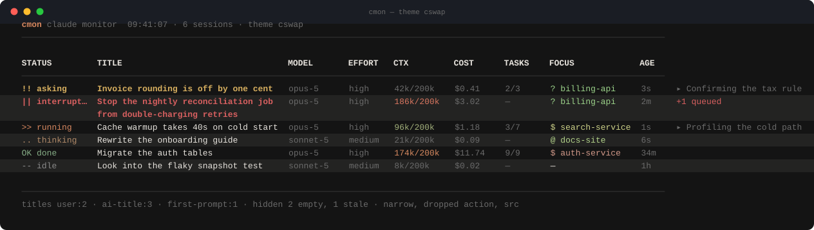
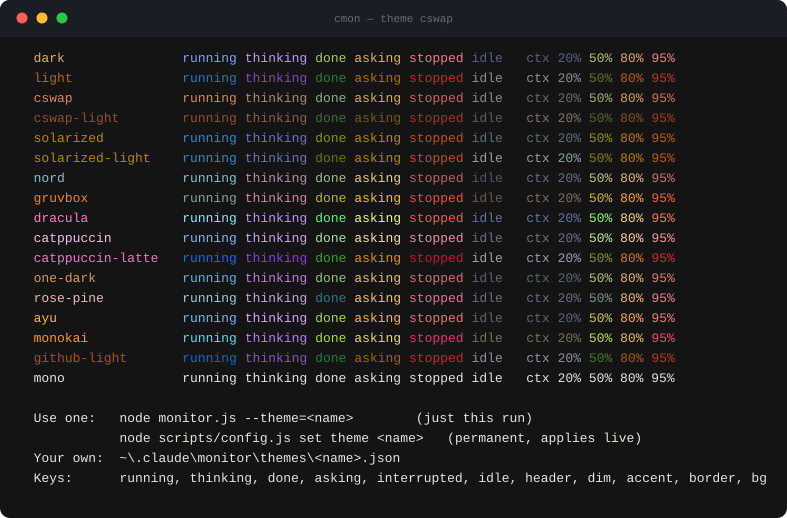

<div align="center">

# claudeMonitor

**A read-only wall display for every Claude Code session you have open.**

One row per session · the title you actually gave it · a status read from the
transcript · what each one is costing you · and which project it is really about.

[](https://nodejs.org)
[](package.json)
[](lib/platform/win32.js)
[](test/run.js)
[](lib/themes.js)

<picture>
  <source media="(prefers-color-scheme: dark)" srcset="assets/monitor-dark.svg">
  <source media="(prefers-color-scheme: light)" srcset="assets/monitor-light.svg">
  
</picture>

<sub>Fabricated sessions — screenshots are generated from <code>--demo</code>, never from a real machine.</sub>

</div>

---

## What it tells you that a list of tabs cannot

| | |
|---|---|
| 🔔 **Who is waiting on you** | `asking` and `interrupted` sort to the top and pulse. Everything else is noise until you have dealt with them. |
| 🎨 **How full each context is** | `353k 35%` on a green→amber→red ramp. The red one is the chat to compact next. |
| 💸 **What it has cost** | Per session, from the token counters and the current price list. |
| 🏷 **Which project it is about** | Every VS Code chat shares one `cwd`; the `focus` tag is worked out from the conversation instead. Same project = same colour and glyph, always. |
| 🧭 **What it is doing right now** | The tool it is running, plan progress (`3/7`), the task in flight, anything you left queued. |

It watches; it never drives. No hooks, nothing written into Claude Code's own
directories, `settings.json` untouched. Two keys: `t` for themes, `g` for
grouping.

---

## Install

```powershell
git clone https://github.com/ekrtp/claudeMonitor.git
cd claudeMonitor
node monitor.js
```

Then put it on your PATH so it runs from anywhere:

```powershell
node scripts/install-command.js     # installs `cmon` into ~/.local/bin
cmon                                # from any directory
cmon --theme=nord --group=focus     # flags pass straight through
```

The shim calls `node <repo>/monitor.js`, so `git pull` updates the command with
no reinstall; `--uninstall` removes it (moves the shim aside rather than deleting
it). Node 18+; Node 22.5+ additionally unlocks the cost and curated-name columns
through `node:sqlite`.

---

## Themes

Seventeen built in. `cswap` and `cswap-light` are adapted from
[claude-swap](https://pypi.org/project/claude-swap/)'s own TUI theme — its
terracotta accent `#d7875f` and the desaturated severity ramp it uses for usage
bars.

<div align="center">
  
</div>

**Four ways to change it:**

```powershell
# 1. press t while it is running: a bar opens, arrows preview live, enter keeps it
node monitor.js --themes                    # 2. the gallery above, in your terminal
node monitor.js --theme=cswap               # 3. just this run
node scripts/config.js set theme cswap      # 4. permanent; a running monitor picks it up
```

Bring your own as `~/.claude/monitor/themes/<name>.json`:

```json
{
  "running": "#7aa2f7", "thinking": "#bb9af7", "done": "#9ece6a",
  "asking": "#e0af68", "interrupted": "#f7768e", "idle": "#565f89",
  "header": "#c0caf5", "dim": "#565f89", "accent": "#e0af68",
  "border": "#3b4261", "bg": "#1a1b26"
}
```

Missing keys fall back to `dark`, so a partial theme still renders; an unknown
name falls back to `dark` and says so in the header. `NO_COLOR=1` or the `mono`
theme turns colour off entirely — the glyphs still carry every distinction.

---

## Statuses

| | Status | Colour | Read from |
|---|---|---|---|
| `!!` | **asking** | amber, pulsing | an `AskUserQuestion` call, or a permission denial that is still the newest event |
| `⏸` | **interrupted** | red | `[Request interrupted by user]` |
| `/>` | **running** | signature colour, spinner | `stop_reason: "tool_use"` — ACTION names the tool |
| `/.` | **thinking** | second accent, spinner | the newest line is a user turn or a tool result |
| `OK` | **done** | green | `stop_reason: "end_turn"` |
| `--` | **idle** | grey | nothing recent, or a "running" tool older than `idleAfterMs` |

Rows are grouped by status by default, most demanding first. Sub-agent turns
(`isSidechain`) never decide a session's own status. Only the two live states
animate, and the animation repaints the last snapshot rather than re-reading
anything from disk.

---

## Where the title comes from

1. **A name you gave the session** — the ccboard dashboard database
   (`~/.claude/agent-dashboard/dashboard.db`, `sessions.name`). Renaming a
   session never reaches Claude Code's own files, which is why tools that read
   only `~/.claude/sessions` keep showing a stale title.
2. **`ai-title`** from the transcript.
3. **The first non-meta user message** — IDE notifications, slash-command output
   and `<tag>`-wrapped turns are skipped.
4. **`firstPrompt`** recorded by the optional hook.
5. **Project name + short session id.**

The footer names the source every visible row used. Two sessions that resolve to
the same title get their short id appended instead of looking like duplicates.

## Which project is a session about?

Every VS Code chat in a workspace reports the same `cwd`, so the directory tells
you nothing. The `focus` tag is worked out instead:

1. Walk up from `cwd` to the nearest `CLAUDE.md` — that is the workspace root.
   Its folder links are the project list, unioned with the root's real
   sub-directories (a router file is allowed to lag).
2. Score those names against the transcript. A **path** mention
   (`billing-api/src`) counts three times a bare mention in prose, one line
   contributes at most four hits, and the tail counts double — what a session is
   doing now outranks how it opened.
3. Show the winner only if it clears a floor and beats the runner-up by 1.5×;
   otherwise the cell stays `—`, or carries a `?` when the margin is thin.

Each name also gets a colour and a glyph derived from the name itself (FNV-1a),
so the same project looks identical in every row and every run — and the glyph
keeps the distinction when colour is off.

---

## Columns

`status` `title` `project` `focus` `action` `model` `branch` `src` `session`
`time` `ctx` `cost` `tokens` `tasks` `agents` `effort` `mode`

| Column | Meaning | Source |
|---|---|---|
| `ctx` | context occupancy, coloured by how full it is | newest `usage`: input + cache read + cache creation |
| `cost` | money spent by this session | `token_usage` × `model_pricing` |
| `tokens` | all tokens including cache reads | dashboard.db |
| `tasks` | plan progress `3/7`, plus the task in flight after `▸` | `~/.claude/tasks/<session>/*.json` |
| `agents` | running / total sub-agents | dashboard.db |
| `effort`, `mode` | reasoning effort · permission mode | transcript |

Alternate rows carry a faint background band (`zebra`, `zebraStrength`), which is
what makes a wrapped two-line row read as one session instead of two.

`title` and `focus` **wrap onto a second line** instead of being cut off
(`titleLines`, default 2), breaking on spaces, hyphens and underscores. On a
narrow terminal columns drop in a fixed order — `model`, `effort`, `ctx` and
`cost` survive longest — and the footer names what went.

---

## Usage

| Command | |
|---|---|
| `cmon` / `node monitor.js` | live table |
| `--once` | render once and exit |
| `--all` | include empty chat tabs and stale sessions |
| `--since=30m` | only sessions active in the last 30 minutes |
| `--group=focus` | group by `status` (default), `focus`, `project`, `none` |
| `--theme=nord` · `--themes` | pick a theme · preview them all |
| `--columns=status,title,cost,time` | choose your columns |
| `--compact` · `--no-animation` · `--wide` | tighter rows · still glyphs · full session id |
| `--demo` | fabricated sessions (screenshots, testing) |
| `npm test` | 81 fixture assertions, no network, no deps |
| `npm run config` | show or edit the config |
| `npm run probe` | re-measure every file format this depends on |
| `npm run screenshot` | regenerate the README images from `--demo` |

### Configuration

`~/.claude/monitor/config.json`, created on first run and **hot-reloaded** — edit
it while the monitor runs and the next frame picks it up.

```powershell
node scripts/config.js                      # show
node scripts/config.js set groupBy focus
node scripts/config.js set notifications true
node scripts/config.js columns +agents -tasks
node scripts/config.js defaults
```

Every change writes a timestamped backup first. `CLAUDE_MONITOR_CONFIG` points
the tool at a different file — the test suite uses it so a test run can never
touch the config of a board you have open.

```json
{
  "theme": "dark",
  "glyphs": "ascii",
  "columns": ["status", "title", "action", "model", "effort", "ctx", "cost", "tasks", "focus", "src", "time"],
  "refreshMs": 2000,
  "animationMs": 220,
  "density": "comfortable",
  "titleLines": 2,
  "zebra": true,
  "zebraStrength": 0.07,
  "groupBy": "status",
  "window": "4h",
  "showEmpty": false,
  "wide": false,
  "idleAfterMs": 120000,
  "contextLimit": 200000,
  "notifications": false
}
```

### Notifications

`"notifications": true` shows a Windows balloon tip when a session moves into
`asking` or `interrupted` — on the transition only, never on the first frame, and
at most once a minute per session.

### Hooks (optional)

Not required. Installing them only adds the prompt at submit time and
Notification events:

```powershell
node scripts/install-hooks.js --dry-run   # show what would change
node scripts/install-hooks.js             # back up, merge, write
node scripts/uninstall-hooks.js           # remove only ours
```

The installer **merges** — other tools' hooks are preserved, it is idempotent,
and it backs up `settings.json` first.

---

## What it reads

| Path | For | Mode |
|---|---|---|
| `~/.claude/sessions/<PID>.json` | which sessions exist | read only |
| `~/.claude/projects/<enc>/<id>.jsonl` | title, status, model, context, focus, queue | read only, windowed |
| `~/.claude/agent-dashboard/dashboard.db` | curated names, cost, sub-agents | read only, optional |
| `~/.claude/tasks/<session>/*.json` | plan progress | read only |
| `<workspace>/CLAUDE.md` | the project list for `focus` | read only |
| `~/.claude/monitor/config.json` | configuration | read + created once |

Transcripts are never loaded whole: 128 KB from the head for the title, 64 KB
from the tail for the status, 32 KB + 192 KB for the focus scan — all cached per
file mtime, and a resolved `ai-title` is cached permanently. Measured over 33
live sessions: **91 ms cold, 6–9 ms warm**, against a 2 s refresh.

## Differences from upstream

- Rows are keyed by **session**, not by project directory. Upstream wrote
  `~/.claude/sessions/<project>.json`, so every chat in one workspace overwrote
  the same file — one row for N chats, and a single session duplicated across
  every directory it had `cd`'d into.
- Nothing is written into `~/.claude/sessions/`: that is Claude Code's registry.
- Titles, statuses and metadata come from the transcript and the dashboard
  database. `decodeDirName()` is gone — it turned `e-commerce` into
  `e\commerce` — and the real `cwd` is encoded instead.
- No `powershell.exe` spawn every two seconds: liveness is `process.kill(pid, 0)`.
- Seventeen themes with hot reload and a live picker, status grouping,
  cost/context/focus columns, wrapping, a subtle spinner, flicker-free redraw,
  and a fixture test suite.

## Notes

- Windows-first by design; platform code is confined to `lib/platform/win32.js`.
- The dashboard database is read with `node:sqlite`. Without it, names, cost and
  sub-agent counts simply go quiet.
- `npm run probe` re-measures the file formats this code depends on and writes
  `docs/DATA-SOURCES.md` (untracked, redacted by default — it describes *your*
  sessions).
- Upstream has no LICENSE file. This is a personal fork; ask the original author
  about licensing before publishing anything built on it.
- [`CHANGELOG.md`](CHANGELOG.md) tracks what changed in each version.
  [`legacy/`](legacy/) keeps upstream's demo GIF and its generator: superseded
  here, but kept for provenance.

<div align="center"><sub>Fork of <a href="https://github.com/ibrahimokdadov/claudeMonitor">ibrahimokdadov/claudeMonitor</a></sub></div>
